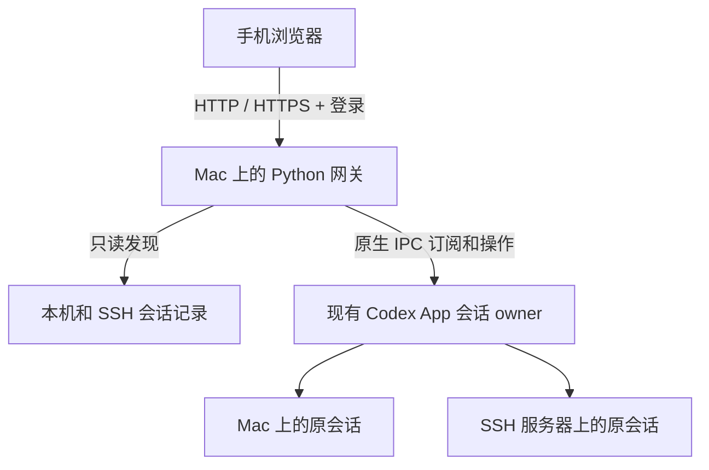

# Codex App 手机网关

在手机浏览器里，继续电脑 **Codex App 已有的聊天**。

手机与电脑打开同一个会话，查看回复、发送消息、选择模型与 Skill、回应待确认操作。本地任务继续在 Mac 执行，SSH 任务继续在原服务器执行；模型请求沿用该会话的提供商与认证配置。

**不要求手机登录与电脑相同的 OpenAI 账号。** 网关提供独立的账号密码登录，也支持显式开启免密访问。可以通过局域网、临时 HTTPS 隧道或自己的反向代理连接。

> 社区项目，与 OpenAI 无隶属关系。当前实现面向 macOS，依赖 Codex App 的内部 IPC；已验证的桌面内置 Codex 运行时版本为 `0.158.0-alpha.2.1`。App 更新后可能需要适配。

**让 Agent 帮你部署：** 将本仓库地址交给 Agent，并让它按[部署 Agent 执行说明](#agent-deployment)完成部署、验收和交付。该章节包含后台启动示例和最终回复模板。

## 功能

| 功能 | 说明 |
| --- | --- |
| 同步 App 聊天 | 读取已有聊天、历史、实时回复和工具输出 |
| 同一会话执行 | 发送新消息、补充当前任务、排队、撤回待发送消息、停止任务 |
| 手机回应 | 支持命令、文件、临时权限请求及提问卡片；复杂请求提示回到桌面处理 |
| SSH 会话 | 显示 Mac App 已连接主机的聊天，操作继续交给对应主机的会话 |
| 聊天列表 | 最近交互排序，或按项目聚合；项目可展开/收起，显示主机标签 |
| 模型设置 | 更改当前聊天的模型与推理强度，支持手动填写自定义模型 ID |
| Skill | 按会话所在主机与工作目录读取已安装技能，搜索后随消息发送原生 Skill 引用 |
| 登录方式 | 独立账号密码；可配置免密 |
| 连接方式 | 局域网 HTTP、Cloudflare 临时 HTTPS、自有 HTTPS 反向代理 |
| 文件预览 | 查看本地聊天引用的工作目录内文件和图片；单个文件不超过 50 MiB |

默认继承桌面会话的模型、provider 和权限策略。手动切换模型时只更新模型与推理强度；模型是否可用取决于当前 provider。

## 运行要求

- macOS，已安装并运行 Codex App。
- Python 3.9 或更高版本；网关本身只使用 Python 标准库，无需 `pip install` 或前端构建。
- Mac 保持唤醒、联网，网关进程保持运行。
- 使用 SSH 聊天时：App 中已配置该主机，Mac 上相应 SSH 别名可非交互连接，远端有 Python 3。模型/Skill 目录还需要远端可用的 Codex 运行时。
- 外网临时隧道可选依赖：`cloudflared`，需要自行安装；仓库不包含该程序。

## 快速开始：局域网

```sh
git clone https://github.com/try2love/codex-mobile-bridge.git
cd codex-mobile-bridge
python3 -B "$PWD/run.py" --lan
```

也可以双击 `启动手机网关.command`。

1. 打开 Mac 上的 Codex App。
2. 启动网关，在终端找到局域网地址，例如 `http://192.168.1.10:8787`。
3. 手机连接同一局域网，用浏览器打开该地址。
4. 账号为 `admin`，首次生成的随机密码保存在项目内 `.local/首次登录.txt`。
5. 选择聊天，看到 **已连接** 后即可发送消息。

如果聊天只显示历史记录，请先在电脑 App 打开该聊天，再点击手机页面的“重新连接”。网关不会自动为尚未加载的聊天启动新的执行实例。

不加 `--lan` 时，仅监听本机 `127.0.0.1`。前台运行时按 `Ctrl+C` 停止；使用以上绝对路径命令或双击脚本启动后，也可以运行 `python3 -B stop.py`，或双击 `停止手机网关.command`。

网关不安装开机启动服务。重启网关后需要重新登录。

## 外网访问：临时 HTTPS 隧道

适合没有公网 IP、没有域名，或手机无法接入校园/公司 VPN 的情况。Mac 主动向隧道服务建立出站连接，手机访问生成的 HTTPS 地址。

### 安装 cloudflared

使用 Homebrew：

```sh
brew install cloudflared
```

也可以从 [Cloudflare 官方下载页](https://developers.cloudflare.com/cloudflare-one/networks/connectors/cloudflare-tunnel/downloads/) 获取对应 macOS 程序。

### 启动

先停止已经占用同一端口的网关，再运行：

```sh
python3 -B "$PWD/run.py" --lan --tunnel --cloudflared "$(command -v cloudflared)"
```

终端会打印随机的 `https://…trycloudflare.com` 地址，同时写入 `.local/外网地址.txt`。手机使用同一套网关账号密码登录，无需登录 Cloudflare。

如果希望使用 `启动外网手机网关.command`，请把可执行的 `cloudflared` 放到 `.local/bin/cloudflared`。Homebrew 安装后也可以创建链接：

```sh
mkdir -p .local/bin
ln -s "$(command -v cloudflared)" .local/bin/cloudflared
```

上述链接命令适用于该目标尚不存在的情况。

临时隧道的使用边界：

- 地址在重启后会变化；停止网关也会停止隧道。
- 流量经过 Cloudflare；它是临时入口，没有持续可用性保证。
- Quick Tunnel 不支持 SSE。本项目在该入口自动使用经登录校验的长轮询，局域网仍使用 SSE。
- 当前隧道使用 HTTP/2，网络需要允许向 Cloudflare 的 TCP 7844 出站连接。
- 如果代理下打不开、直连可以访问，请检查客户端代理规则。

## 自有 HTTPS 入口

将自己的隧道或反向代理指向 `http://127.0.0.1:8787`，保留外部 `Host`，然后启动：

```sh
python3 -B "$PWD/run.py" --origin https://codex.example.com
```

可与 `--lan` 一起使用。允许多个入口时重复传入 `--origin`，或者写入 `.local/config.json` 的 `origins` 数组。值必须是完整 HTTPS 源，不带路径和末尾 `/`。

反向代理需关闭 SSE 缓冲，读取超时建议不少于 300 秒。网关每 12 秒发送保活，SSE 连续失败时网页会回退到长轮询。HTTPS 入口的登录 Cookie 带 `Secure` 属性。

## 手机上的操作

### 列表与 SSH

“显示方式”可选 **最近交互** 或 **按项目**。项目分组可以展开/收起，浏览器会记住选择；主机名与项目名一起展示。

SSH 列表复用 App 保存的连接和项目配置。手机不需要保存 SSH 私钥，也不用安装 SSH 客户端；Mac 负责连接服务器。服务器暂不可达时，列表会显示对应错误，本机会话仍可使用。

### 模型与 Skill

点击输入框上方的模型按钮，选择模型与推理强度。当前任务正在运行时，新设置从下一轮使用。自定义模型 ID 必须由当前 provider 支持。

点击 **Skill**，搜索并选择当前会话可用的已安装技能，最多 8 个。选中项会随下一条消息以原生 Skill 输入传给会话；发送成功后清空选择。SSH 会话读取远端技能目录。

### 发送与回应

- **发送新消息**：启动下一轮任务。
- **完成后发送**：等待当前任务结束，再发送队列中的消息；发送前可以撤回。
- **补充当前任务**：向正在执行的任务追加输入。
- **停止**：请求停止当前任务。
- **回应卡片**：查看请求内容后，批准本次操作、拒绝或回答问题。

支持 `Ctrl/Cmd + Enter` 发送。手机可把网页添加到主屏幕；没有离线缓存聊天的 Service Worker。

## 账号密码与免密

登录账号与 Codex 模型认证相互独立，不需要把模型 API key 放到手机。

### 修改密码

停止网关后执行：

```sh
python3 -B run.py --set-password
python3 -B "$PWD/run.py" --lan
```

密码至少 12 位。账号名可修改 `.local/config.json` 中的 `auth.username`。

### 显式免密

```sh
python3 -B "$PWD/run.py" --lan --no-auth
```

也可将配置中的 `auth.mode` 设置为 `none`。免密页面仍需点击连接，以建立会话和 CSRF 令牌。**免密时，任何能访问网关的人都能读取聊天并控制对应 Codex 会话**，仅适合受控网络。

默认密码以独立随机 salt 和 PBKDF2-HMAC-SHA256 保存，登录有效期 12 小时。HTTP API、SSE 和长轮询都需要登录，并校验 Host、Origin；写操作另校验 CSRF。该网关面向个人使用，没有多用户角色隔离，不应共享账号。

## 实现原理



- **发现与历史**：只读查询 Codex 的 SQLite 和会话记录；SSH 主机通过已有别名执行只读脚本。
- **实时状态**：连接 App 的 Unix IPC，订阅快照与增量更新；SSH 会话从携带 `hostId` 的订阅快照识别 owner。
- **执行与授权**：消息、模型设置、停止与审批回应都路由到原 owner，保留会话 ID、工作目录、provider 和权限上下文。
- **模型/Skill 目录**：使用短时 `app-server` 元数据辅助进程，仅调用初始化、`model/list` 和 `skills/list`；它不恢复会话或执行任务。

实现不修改桌面 App、不写原始聊天数据库、不直接读取或转发模型 API key。Codex 运行时仍使用自己的既有认证配置。

更多协议与模块说明见 [实现说明](ARCHITECTURE.md)，验证范围见 [验证记录](VERIFICATION.md)。

## 数据保存

所有运行数据默认保存在项目的 `.local/` 中：

| 文件 | 用途 |
| --- | --- |
| `config.json` | 网关账号、密码摘要与允许的入口 |
| `首次登录.txt` | 首次生成的网关密码；修改密码后删除 |
| `submissions.json` | 本地聊天的发送去重记录、正文与队列 |
| `hosts/<主机哈希>/submissions.json` | 按 SSH 主机隔离的发送记录 |
| `gateway.pid` | 本网关进程记录 |
| `外网地址.txt`、`tunnel.log` | 临时隧道地址与日志 |

服务前台日志输出到启动终端。`.local/`、`.tmp/`、环境文件与本地开发记录均已加入 `.gitignore`，不要把它们上传到 issue 或公开仓库。

如果发送的确认响应丢失，页面会显示“发送结果待确认”，网关不会自动重发。删除发送记录会丢失去重信息与队列。

## 已知限制

- 当前仅验证 macOS 桌面环境；Windows、Linux 桌面未适配。
- 内部 IPC 不是稳定的公开 API；Codex App 更新后可能出现不兼容。
- 尚未加载的聊天可查看保存历史，发送前可能需要在 App 中打开一次。
- SSH 连接需已有可非交互使用的认证；网关不提供 SSH 密码、主机指纹或 MFA 交互。
- 云聊天、手机上传附件、SSH 文件下载尚未接入。
- 本地文件只允许访问聊天引用的工作目录及 Codex visualizations 内文件；目录外附件只显示描述。
- 复杂 MCP 表单、身份验证挑战和部分特殊请求需要在桌面处理。
- 保存历史的格式可能含上下文注入文本，手机排版与桌面不保证完全一致。
- 设计上复用 API、自定义 provider 和官方登录配置；实测覆盖自定义 provider，未穷举所有登录方式与服务商。

<a id="agent-deployment"></a>

## 给部署 Agent 的执行说明

本节面向替用户部署本项目的 Agent。交付目标是：**用户拿到可用的手机访问地址和登录方式，打开原 Codex App 的同一条会话，消息仍由原 Mac 或 SSH 服务器执行，并能收到结果与待确认请求。** 用户只要求其中一部分时，按其范围部署；已有选择和授权可以复用。

用户可以直接把下面这段话和仓库地址交给 Agent：

> 请按 README 的“给部署 Agent 的执行说明”，在运行我 Codex App 的 Mac 上部署手机网关。复用已有聊天、模型认证和 SSH 连接，默认使用账号密码。根据我已说明的联网需求配置访问入口，完成当前环境的验收，保持网关可继续使用，最后给我访问链接、登录方式、启停方法、验证结果及仍需我完成的步骤。

### 1. 确定目标环境与访问方式

先读取本 README、[实现说明](ARCHITECTURE.md)和[验证记录](VERIFICATION.md)，再检查用户当前环境。仓库中的验证记录是已知兼容性证据，实际部署仍需按下文验收。

| 项目 | Agent 应执行的动作 |
| --- | --- |
| 部署主机 | 在运行 Codex App 的 Mac 上部署网关；SSH 服务器保留原有 Codex 执行环境 |
| 安装目录 | 使用用户指定目录；已有仓库先检查版本与本地修改，保留 `.local/` 内的账号、去重和队列记录 |
| 系统与运行时 | 检查 macOS、`python3 --version`、App 是否运行，以及 App 内置 Codex 运行时版本；不要因版本不同就宣称兼容 |
| 数据目录 | 按实际 `--codex-home`、`CODEX_HOME` 或默认 `~/.codex` 定位；检查会话数据库和 `ipc/ipc.sock`，保留已有认证配置 |
| 端口与进程 | 检查计划使用的端口及本项目 `gateway.pid`；已有可用服务优先复用，停止或重启前核对进程归属 |
| 登录 | 默认账号密码；仅在用户明确选择免密时启用 `--no-auth`；不要求用户提供模型 API key |
| 局域网 | 用户在同一网络使用时启动 `--lan`，交付手机能访问的实际局域网 IP |
| 外网 | 按用户选择配置临时 HTTPS 隧道或现有 HTTPS 入口；涉及新安装和对外暴露时遵守已有授权范围 |
| SSH | 检查 App 已保存的主机与项目，以及已有 SSH 别名能否非交互连接；不把本机模型目录、技能路径或登录状态套用到远端 |

如果尚不清楚用户是否需要外网，只询问这个会改变部署方案的问题，继续完成不依赖答案的本地检查。系统权限、软件安装、专用测试聊天等也按当前会话已有授权处理，不重复索要已给出的许可。

不要为了让网关显示“已连接”而修改 Codex 原数据库、替换 provider、重启远端模型服务，或另起 CLI 会话冒充 App 会话。需要修改实现时，先定位版本或协议差异，并保留原会话。

### 2. 准备并启动服务

1. 按本 README 的快速开始准备仓库。在仓库根目录运行自动测试；测试不需要真实模型账号。受限工具环境若禁止临时 TCP/Unix socket，应按该环境的权限流程处理并如实记录。
2. 只有选择隧道时才准备 `cloudflared`。复用已有可执行文件，核对路径；缺少时按用户授权使用官方安装来源。
3. 按上文选择 **一套** 启动参数：局域网 `--lan`；临时外网 `--lan --tunnel --cloudflared <实际路径>`；自有入口 `--origin <实际 HTTPS 源>`。需要同时保留局域网入口时再加 `--lan`。
4. 使用 `run.py` 的绝对路径启动，让 `stop.py` 可以验证进程。默认使用项目内 `.local/` 配置；换端口时统一更新检查命令和交付地址。
5. 为用户保留可以持续运行的进程，并记录启动方式、PID、日志和停止方式。

**前台方式：** 在用户可以保留的终端中执行前面的启动命令。交付时说明该终端需要保持运行，以及如何用 `Ctrl+C` 停止。

**后台方式：** 若 Agent 的执行环境允许保留子进程，确认没有已有实例占用目标端口后，可在仓库根目录使用以下 Python 3.9+ 示例。先按已选方案修改 `serve_args`；示例默认只启用局域网和账号密码。

```sh
python3 -B - <<'PY'
import os
import subprocess
import sys
from pathlib import Path

root = Path.cwd().resolve()
assert (root / "run.py").is_file(), "请在仓库根目录执行"
serve_args = ["--lan"]
# 临时外网：改为 ["--lan", "--tunnel", "--cloudflared", "已核对的绝对路径"]
# 自有入口：改为 ["--origin", "用户的实际 HTTPS 源"]
os.umask(0o077)
data_dir = root / ".local"
data_dir.mkdir(mode=0o700, exist_ok=True)
with (data_dir / "gateway.log").open("ab") as log:
    process = subprocess.Popen(
        [sys.executable, "-B", str(root / "run.py"), *serve_args],
        cwd=str(root),
        stdin=subprocess.DEVNULL,
        stdout=log,
        stderr=subprocess.STDOUT,
        start_new_session=True,
    )
print("启动请求已提交，PID:", process.pid)
print("日志:", data_dir / "gateway.log")
PY
```

PID 只表示子进程已创建。**启动工具调用返回之后，再用独立的一次检查确认进程存活、HTTP 就绪、App 会话可连接。** 工具环境可能回收后台进程；若不能持续保留，改用用户终端等允许的运行方式并说明剩余操作。该示例不配置开机启动，也不保证 Mac 睡眠后继续在线。

默认端口可先做以下无凭据检查；使用其他端口时替换 `8787`：

```sh
python3 -B - <<'PY'
import json
import urllib.error
import urllib.request

opener = urllib.request.build_opener(urllib.request.ProxyHandler({}))
base = "http://127.0.0.1:8787"
with opener.open(base + "/api/auth", timeout=5) as response:
    print("认证状态:", json.load(response))
try:
    opener.open(base + "/api/sessions", timeout=5)
except urllib.error.HTTPError as error:
    assert error.code == 401, "聊天接口返回非预期状态"
    print("未登录读取聊天: 401，符合预期")
else:
    raise RuntimeError("未登录即可读取聊天，请先检查认证")
PY
```

临时隧道建立时可能需要等待一段时间。结合本次进程、最新启动日志和当前 `.local/外网地址.txt` 判断状态，并实际请求该 HTTPS 地址；隧道失败时网关仍可能提供本地服务，应分别记录两个结果。

### 3. 按用户需求验收真实链路

在浏览器登录并验收用户需要的功能。复用获准的专用测试聊天；需要新建聊天或执行真实模型测试时，先确认已有授权覆盖该动作。不要向用户正在进行的工作聊天注入测试消息，也不要为测试改变其权限策略。

| 验收项 | 判定依据 |
| --- | --- |
| 登录与访问保护 | 正确凭据可登录；未登录读取聊天被拒绝；默认密码模式下错误密码不能登录 |
| 原 App 会话读取 | 选中已知聊天，核对标题、主机、工作目录与历史；状态为“已连接”，并能接收后续更新 |
| 同一会话发消息 | 在获准测试聊天发送一个短标记，确认原 App 的同一会话收到输入并产生助手回复；不能把用户消息里的标记当作助手回复 |
| 手机回应 | 在获准测试中回答问题卡片；有实际人工审批时验证其对应请求。自动审批未出现人工卡片时，应标注人工审批未实测 |
| 模型与 Skill | 在获准测试聊天更改模型/推理强度，确认生效后恢复；选择一个已安装且适合测试的 Skill，确认 App 收到原生 Skill 输入，provider 不变 |
| SSH | 核对远端主机、cwd 与实时内容；模型/Skill 来自该主机。SSH 发送和人工审批分别记录是否实测 |
| 列表 | “最近交互”排序正确；“按项目”可展开/收起，同名但不同主机的项目可区分 |
| 外网 | 用实际 HTTPS 地址登录并读取会话；临时隧道下确认长轮询有更新。只测本机回环地址不构成外网验收 |
| 持续运行 | 启动工具调用结束后仍能访问；完成交付时服务存活，并能按记录的方式停止、重新启动 |

若无法操作真实手机，可先完成桌面浏览器手机尺寸及公网 URL 验收，再请用户用手机确认；交付中明确区分两者。手机蜂窝网络可达性需要真实移动网络验证，Mac 上访问公网地址不能代替这一项。

每项结果使用“当前环境实测通过 / 自动测试覆盖 / 待用户确认 / 未验证 / 不适用”等明确状态。仓库测试通过、页面打开、模型返回成功，各自只证明对应环节。

### 4. 遇到问题时定位到对应环节

| 现象 | 下一步 |
| --- | --- |
| 端口已占用或进程退出 | 核对该端口服务、PID 和本次日志；复用已有网关，或按授权停止本项目旧实例，不终止不明进程 |
| 找不到聊天数据库或 IPC | 核对实际 Codex 数据目录、App 运行状态和文件访问权限 |
| 只有历史记录，不能发送 | 核对 App 连接与协议版本；冷聊天可能需在桌面打开一次。SSH 普通 owner 查询失败不等于聊天未打开，应检查本项目的订阅发现路径 |
| SSH 列表为空或主机不可达 | 核对 App 主机/项目映射、已有 SSH 认证、远端 Python 与数据目录；不会显示在本地数据库中的远端记录需通过 SSH 读取 |
| 模型或 Skill 目录读取失败 | 核对对应主机的 Codex 运行时路径、会话 cwd 和目录错误；不要替换原会话 provider 来绕过问题 |
| 本机可用，局域网不可用 | 核对 `--lan`、实际 IP、同网访问条件及系统防火墙；网络地址变化后按需重启网关 |
| HTTPS 不可用，本地正常 | 检查当前隧道进程、最新地址、TCP 7844 出站条件和代理路径；直连检查不能证明所有用户网络都可达 |
| 发送结果待确认 | 先查原 App 会话与该消息状态，保持原提交 ID，不盲目重复发送 |

保留已验证有效的部分，修复有证据的问题。需要用户操作时给出具体动作及原因；不要把未完成环节写成成功，也不要通过关闭认证、放宽 Host/Origin 或修改原始数据库来制造成功结果。

### 5. 最终给用户返回什么

最终回复应让用户可以立即打开手机开始使用，并可以自行停止和重启。使用**当前环境的真实值**填写以下内容：

- **状态与入口**：部署完成或部分完成；可点击的局域网/HTTPS 地址及各自测试状态。`127.0.0.1` 只供本机检查，不能作为手机访问地址。
- **登录方式**：实际账号，以及初始网关密码的交付方式。在合适的私密渠道按用户需要提供网关密码，或给出可点击的本机凭据文件；若密码已修改、初始文件已删除，则说明沿用现有密码及重置方法。公开 issue、README 和日志中不写入密码。
- **运行与管理**：部署目录、版本/commit、前台或后台运行方式、PID、准确的停止和再次启动命令；后台方式给出日志路径，自定义配置时给出实际路径。
- **验收结果**：列出本地聊天、发送、回应、模型、Skill、SSH 和外网的适用结果，区分真实测试、自动测试和待确认项。
- **使用条件与后续动作**：Mac、App、网关和所需 SSH 连接需保持在线；临时域名重启会变化；只列出尚需用户完成的具体操作。

可以使用以下模板，删掉不适用项。方括号必须替换为实测值或明确的未完成状态，不要照抄示例地址：

```text
部署状态：[已完成 / 部分完成及原因]

手机访问：
- 局域网：[实际可点击 URL]（[验证状态]）
- 外网：[实际可点击 HTTPS URL / 未启用]（[验证状态]）

登录：
- 账号：[实际账号]
- 密码：[私密交付的网关密码 / 可点击的凭据文件 / 沿用现有密码]
- 修改密码：[在实际部署目录执行的命令]

运行管理：
- 目录与版本：[绝对路径]，[commit]
- 当前进程：[前台终端或后台方式]，PID [实际值]
- 停止：[与本次启动方式相符的命令]
- 再次启动：[含真实端口、隧道程序路径或 origin 的完整命令]
- 日志：[实际文件路径 / 对应前台终端]

验收：
- 原 App 会话读取与发送：[状态]
- 手机问题回应与人工审批：[分别说明状态]
- 模型与 Skill：[状态]
- SSH 会话：[主机与已验证范围 / 不适用]
- 列表与外网：[状态]

使用时请保持 Mac、Codex App、网关及所需 SSH 连接运行。
[启用临时隧道时：重启后从实际“外网地址.txt”取得新地址。]
还需你完成：[具体步骤 / 无；真实手机尚未验证时明确写出]
```

## 开发与测试

```sh
python3 -B -m unittest discover -s tests -v
```

测试使用项目 `.tmp/` 下的合成数据和本机临时 TCP/Unix socket，不需要真实账号、运行中的 Codex App 或模型请求。请在仓库根目录执行。

前端为原生 HTML/CSS/JavaScript，无构建步骤。修改后刷新页面即可；修改后端需重启网关。

## 问题反馈

欢迎提交 [Issue](https://github.com/try2love/codex-mobile-bridge/issues) 或 Pull Request。请附上系统、App/运行时版本、连接方式和脱敏后的错误信息。不要提交 API key、网关密码、完整聊天记录或私有配置文件。

## 许可证与参考

项目源码使用 [MIT License](LICENSE)。Codex App 和 cloudflared 为独立软件，未随本仓库分发，遵循各自许可。

- [OpenAI Codex App Server 文档](https://learn.chatgpt.com/docs/app-server)
- [Cloudflare Quick Tunnel 文档](https://developers.cloudflare.com/cloudflare-one/networks/connectors/cloudflare-tunnel/do-more-with-tunnels/trycloudflare/)
- [cloudflared 官方源码](https://github.com/cloudflare/cloudflared)
