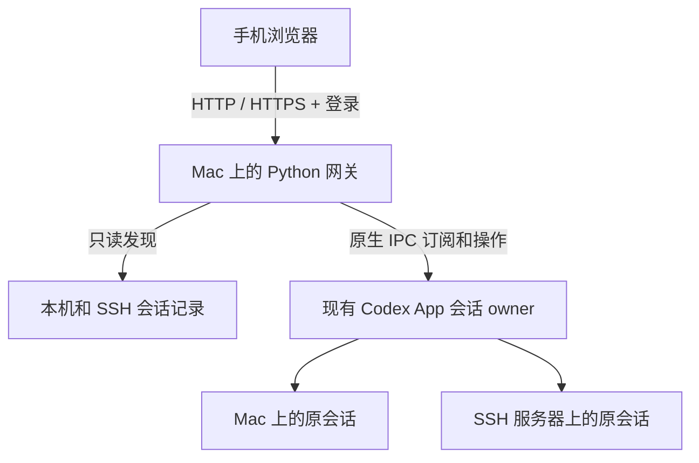

# Codex App 手机网关

在手机浏览器里，继续电脑 **Codex App 已有的聊天**。

手机与电脑打开同一个会话，查看回复、发送消息、选择模型与 Skill、回应待确认操作。本地任务继续在 Mac 执行，SSH 任务继续在原服务器执行；模型请求沿用该会话的提供商与认证配置。

**不要求手机登录与电脑相同的 OpenAI 账号。** 网关提供独立的账号密码登录，也支持显式开启免密访问。可以通过局域网、临时 HTTPS 隧道或自己的反向代理连接。

> 社区项目，与 OpenAI 无隶属关系。当前实现面向 macOS，依赖 Codex App 的内部 IPC；已验证的桌面内置 Codex 运行时版本为 `0.158.0-alpha.2.1`。App 更新后可能需要适配。

## 功能

| 功能 | 说明 |
| --- | --- |
| 同步 App 聊天 | 读取已有聊天、历史、实时回复和工具输出 |
| 同一会话执行 | 发送新消息、补充当前任务、排队、撤回待发送消息、停止任务 |
| 手机回应 | 支持命令、文件、临时权限请求及提问卡片；复杂请求提示回到桌面处理 |
| SSH 会话 | 显示 Mac App 已连接主机的聊天，操作继续交给对应主机的会话 |
| 聊天列表 | 最近交互排序，或按项目聚合；项目可展开/收起，显示主机标签 |
| 模型设置 | 更改当前聊天的模型与推理强度，支持手动填写自定义模型 ID |
| Skill | 按会话所在主机与工作目录读取已安装技能，搜索后随消息发送原生 Skill 引用 |
| 登录方式 | 独立账号密码；可配置免密 |
| 连接方式 | 局域网 HTTP、Cloudflare 临时 HTTPS、自有 HTTPS 反向代理 |
| 文件预览 | 查看本地聊天引用的工作目录内文件和图片；单个文件不超过 50 MiB |

默认继承桌面会话的模型、provider 和权限策略。手动切换模型时只更新模型与推理强度；模型是否可用取决于当前 provider。

## 运行要求

- macOS，已安装并运行 Codex App。
- Python 3.9 或更高版本；网关本身只使用 Python 标准库，无需 `pip install` 或前端构建。
- Mac 保持唤醒、联网，网关进程保持运行。
- 使用 SSH 聊天时：App 中已配置该主机，Mac 上相应 SSH 别名可非交互连接，远端有 Python 3。模型/Skill 目录还需要远端可用的 Codex 运行时。
- 外网临时隧道可选依赖：`cloudflared`，需要自行安装；仓库不包含该程序。

## 快速开始：局域网

```sh
git clone https://github.com/try2love/codex-mobile-bridge.git
cd codex-mobile-bridge
python3 -B "$PWD/run.py" --lan
```

也可以双击 `启动手机网关.command`。

1. 打开 Mac 上的 Codex App。
2. 启动网关，在终端找到局域网地址，例如 `http://192.168.1.10:8787`。
3. 手机连接同一局域网，用浏览器打开该地址。
4. 账号为 `admin`，首次生成的随机密码保存在项目内 `.local/首次登录.txt`。
5. 选择聊天，看到 **已连接** 后即可发送消息。

如果聊天只显示历史记录，请先在电脑 App 打开该聊天，再点击手机页面的“重新连接”。网关不会自动为尚未加载的聊天启动新的执行实例。

不加 `--lan` 时，仅监听本机 `127.0.0.1`。前台运行时按 `Ctrl+C` 停止；使用以上绝对路径命令或双击脚本启动后，也可以运行 `python3 -B stop.py`，或双击 `停止手机网关.command`。

网关不安装开机启动服务。重启网关后需要重新登录。

## 外网访问：临时 HTTPS 隧道

适合没有公网 IP、没有域名，或手机无法接入校园/公司 VPN 的情况。Mac 主动向隧道服务建立出站连接，手机访问生成的 HTTPS 地址。

### 安装 cloudflared

使用 Homebrew：

```sh
brew install cloudflared
```

也可以从 [Cloudflare 官方下载页](https://developers.cloudflare.com/cloudflare-one/networks/connectors/cloudflare-tunnel/downloads/) 获取对应 macOS 程序。

### 启动

先停止已经占用同一端口的网关，再运行：

```sh
python3 -B "$PWD/run.py" --lan --tunnel --cloudflared "$(command -v cloudflared)"
```

终端会打印随机的 `https://…trycloudflare.com` 地址，同时写入 `.local/外网地址.txt`。手机使用同一套网关账号密码登录，无需登录 Cloudflare。

如果希望使用 `启动外网手机网关.command`，请把可执行的 `cloudflared` 放到 `.local/bin/cloudflared`。Homebrew 安装后也可以创建链接：

```sh
mkdir -p .local/bin
ln -s "$(command -v cloudflared)" .local/bin/cloudflared
```

上述链接命令适用于该目标尚不存在的情况。

临时隧道的使用边界：

- 地址在重启后会变化；停止网关也会停止隧道。
- 流量经过 Cloudflare；它是临时入口，没有持续可用性保证。
- Quick Tunnel 不支持 SSE。本项目在该入口自动使用经登录校验的长轮询，局域网仍使用 SSE。
- 当前隧道使用 HTTP/2，网络需要允许向 Cloudflare 的 TCP 7844 出站连接。
- 如果代理下打不开、直连可以访问，请检查客户端代理规则。

## 自有 HTTPS 入口

将自己的隧道或反向代理指向 `http://127.0.0.1:8787`，保留外部 `Host`，然后启动：

```sh
python3 -B "$PWD/run.py" --origin https://codex.example.com
```

可与 `--lan` 一起使用。允许多个入口时重复传入 `--origin`，或者写入 `.local/config.json` 的 `origins` 数组。值必须是完整 HTTPS 源，不带路径和末尾 `/`。

反向代理需关闭 SSE 缓冲，读取超时建议不少于 300 秒。网关每 12 秒发送保活，SSE 连续失败时网页会回退到长轮询。HTTPS 入口的登录 Cookie 带 `Secure` 属性。

## 手机上的操作

### 列表与 SSH

“显示方式”可选 **最近交互** 或 **按项目**。项目分组可以展开/收起，浏览器会记住选择；主机名与项目名一起展示。

SSH 列表复用 App 保存的连接和项目配置。手机不需要保存 SSH 私钥，也不用安装 SSH 客户端；Mac 负责连接服务器。服务器暂不可达时，列表会显示对应错误，本机会话仍可使用。

### 模型与 Skill

点击输入框上方的模型按钮，选择模型与推理强度。当前任务正在运行时，新设置从下一轮使用。自定义模型 ID 必须由当前 provider 支持。

点击 **Skill**，搜索并选择当前会话可用的已安装技能，最多 8 个。选中项会随下一条消息以原生 Skill 输入传给会话；发送成功后清空选择。SSH 会话读取远端技能目录。

### 发送与回应

- **发送新消息**：启动下一轮任务。
- **完成后发送**：等待当前任务结束，再发送队列中的消息；发送前可以撤回。
- **补充当前任务**：向正在执行的任务追加输入。
- **停止**：请求停止当前任务。
- **回应卡片**：查看请求内容后，批准本次操作、拒绝或回答问题。

支持 `Ctrl/Cmd + Enter` 发送。手机可把网页添加到主屏幕；没有离线缓存聊天的 Service Worker。

## 账号密码与免密

登录账号与 Codex 模型认证相互独立，不需要把模型 API key 放到手机。

### 修改密码

停止网关后执行：

```sh
python3 -B run.py --set-password
python3 -B "$PWD/run.py" --lan
```

密码至少 12 位。账号名可修改 `.local/config.json` 中的 `auth.username`。

### 显式免密

```sh
python3 -B "$PWD/run.py" --lan --no-auth
```

也可将配置中的 `auth.mode` 设置为 `none`。免密页面仍需点击连接，以建立会话和 CSRF 令牌。**免密时，任何能访问网关的人都能读取聊天并控制对应 Codex 会话**，仅适合受控网络。

默认密码以独立随机 salt 和 PBKDF2-HMAC-SHA256 保存，登录有效期 12 小时。HTTP API、SSE 和长轮询都需要登录，并校验 Host、Origin；写操作另校验 CSRF。该网关面向个人使用，没有多用户角色隔离，不应共享账号。

## 实现原理



- **发现与历史**：只读查询 Codex 的 SQLite 和会话记录；SSH 主机通过已有别名执行只读脚本。
- **实时状态**：连接 App 的 Unix IPC，订阅快照与增量更新；SSH 会话从携带 `hostId` 的订阅快照识别 owner。
- **执行与授权**：消息、模型设置、停止与审批回应都路由到原 owner，保留会话 ID、工作目录、provider 和权限上下文。
- **模型/Skill 目录**：使用短时 `app-server` 元数据辅助进程，仅调用初始化、`model/list` 和 `skills/list`；它不恢复会话或执行任务。

实现不修改桌面 App、不写原始聊天数据库、不直接读取或转发模型 API key。Codex 运行时仍使用自己的既有认证配置。

更多协议与模块说明见 [实现说明](ARCHITECTURE.md)，验证范围见 [验证记录](VERIFICATION.md)。

## 数据保存

所有运行数据默认保存在项目的 `.local/` 中：

| 文件 | 用途 |
| --- | --- |
| `config.json` | 网关账号、密码摘要与允许的入口 |
| `首次登录.txt` | 首次生成的网关密码；修改密码后删除 |
| `submissions.json` | 本地聊天的发送去重记录、正文与队列 |
| `hosts/<主机哈希>/submissions.json` | 按 SSH 主机隔离的发送记录 |
| `gateway.pid` | 本网关进程记录 |
| `外网地址.txt`、`tunnel.log` | 临时隧道地址与日志 |

服务前台日志输出到启动终端。`.local/`、`.tmp/`、环境文件与本地开发记录均已加入 `.gitignore`，不要把它们上传到 issue 或公开仓库。

如果发送的确认响应丢失，页面会显示“发送结果待确认”，网关不会自动重发。删除发送记录会丢失去重信息与队列。

## 已知限制

- 当前仅验证 macOS 桌面环境；Windows、Linux 桌面未适配。
- 内部 IPC 不是稳定的公开 API；Codex App 更新后可能出现不兼容。
- 尚未加载的聊天可查看保存历史，发送前可能需要在 App 中打开一次。
- SSH 连接需已有可非交互使用的认证；网关不提供 SSH 密码、主机指纹或 MFA 交互。
- 云聊天、手机上传附件、SSH 文件下载尚未接入。
- 本地文件只允许访问聊天引用的工作目录及 Codex visualizations 内文件；目录外附件只显示描述。
- 复杂 MCP 表单、身份验证挑战和部分特殊请求需要在桌面处理。
- 保存历史的格式可能含上下文注入文本，手机排版与桌面不保证完全一致。
- 设计上复用 API、自定义 provider 和官方登录配置；实测覆盖自定义 provider，未穷举所有登录方式与服务商。

## 开发与测试

```sh
python3 -B -m unittest discover -s tests -v
```

测试使用项目 `.tmp/` 下的合成数据和本机临时 TCP/Unix socket，不需要真实账号、运行中的 Codex App 或模型请求。请在仓库根目录执行。

前端为原生 HTML/CSS/JavaScript，无构建步骤。修改后刷新页面即可；修改后端需重启网关。

## 问题反馈

欢迎提交 [Issue](https://github.com/try2love/codex-mobile-bridge/issues) 或 Pull Request。请附上系统、App/运行时版本、连接方式和脱敏后的错误信息。不要提交 API key、网关密码、完整聊天记录或私有配置文件。

## 许可证与参考

项目源码使用 [MIT License](LICENSE)。Codex App 和 cloudflared 为独立软件，未随本仓库分发，遵循各自许可。

- [OpenAI Codex App Server 文档](https://learn.chatgpt.com/docs/app-server)
- [Cloudflare Quick Tunnel 文档](https://developers.cloudflare.com/cloudflare-one/networks/connectors/cloudflare-tunnel/do-more-with-tunnels/trycloudflare/)
- [cloudflared 官方源码](https://github.com/cloudflare/cloudflared)
